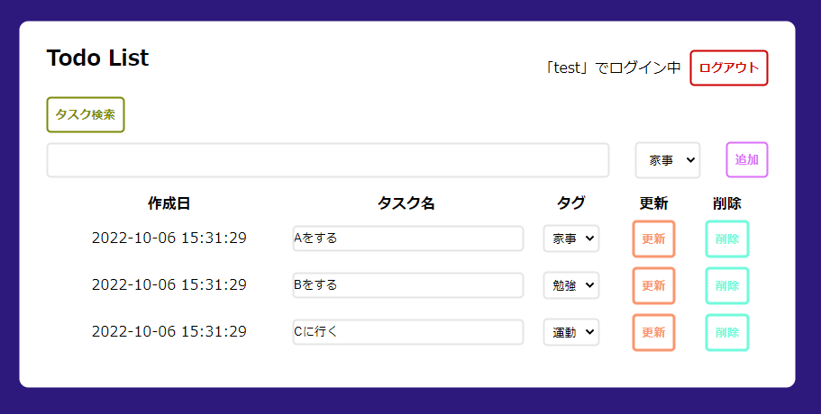
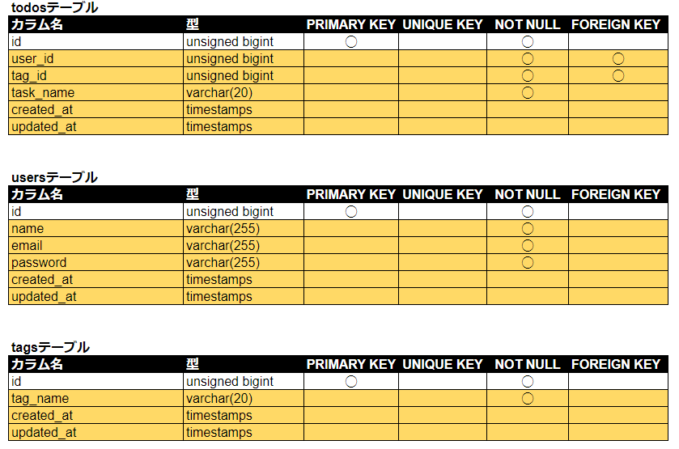
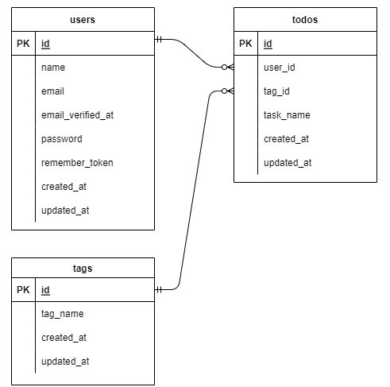

# Todoアプリ

## 作成目的
Laravelの基礎を学ぶために作成

## 機能一覧
- Todoの追加・更新・削除
- タスク・タグの検索機能

## 使用技術（実行環境）
- Laravel 8.83.23
- Windows 10 64bit Pro

## テーブル設計

## ER図

## その他
- アカウント登録画面は/registerから入る
- 環境構築
  - XAMPP 3.3.0
